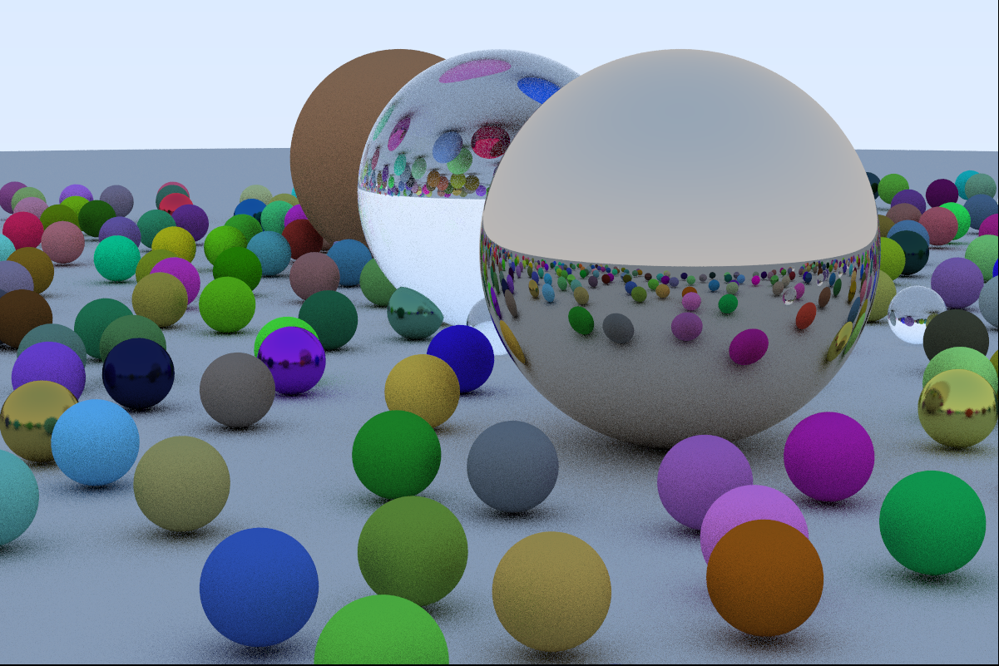

# A Raytracer in Rust

- This repository contains the implementation of a raytracer written in Rust based on the book [Ray Tracing in One Weekend](https://raytracing.github.io/books/RayTracingInOneWeekend.html).
- The implementation served as a learning project and was developed while working through the book [The Rust Programming Language](https://doc.rust-lang.org/book/).

## Raytracer Features

- Implementation of different materials (diffuse, metal,  and dielectrics)
- Positionable camera, depth of field, and antialiasing
- Image output in PPM format

## Next steps

- add additional tests (unit tests and integration tests)
- parallelize raytracing

## Usage

To generate the image above run the command `cargo run > image_file_name.ppm`
in the terminal (this might take a while). To just render the three big spheres and reduce the computing time, comment the marked section in **raytracing.rs**.
